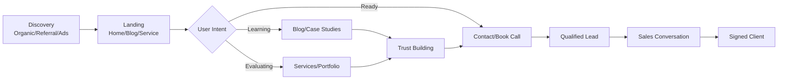
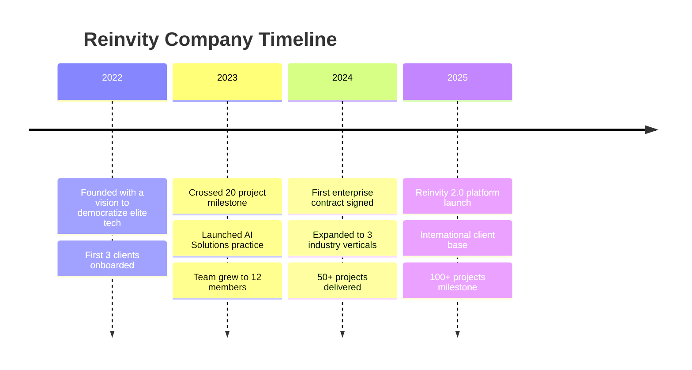
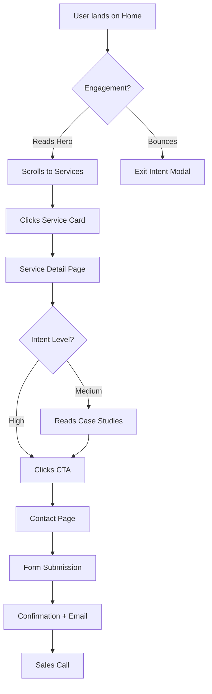

# Reinvity — Complete Website Strategy, UX Specification & Development Blueprint

> **Document Version:** 1.0  
> **Classification:** Internal Strategy & Development Reference  
> **Scope:** Full-stack website design, development, and growth blueprint  
> **Stack:** Next.js 15+ · TypeScript · Tailwind CSS · Shadcn UI · Framer Motion · Vercel

---

## Table of Contents

1. [Project Overview](#1-project-overview)
2. [Information Architecture](#2-information-architecture)
3. [Complete Website Structure](#3-complete-website-structure)
4. [Home Page Blueprint](#4-home-page-blueprint)
5. [About Page](#5-about-page)
6. [Services Page](#6-services-page)
7. [Portfolio Page](#7-portfolio-page)
8. [Case Studies](#8-case-studies)
9. [Testimonials System](#9-testimonials-system)
10. [Blog System](#10-blog-system)
11. [Contact Page](#11-contact-page)
12. [Lead Generation Strategy](#12-lead-generation-strategy)
13. [User Experience Design](#13-user-experience-design)
14. [Theme System](#14-theme-system)
15. [UI Design System](#15-ui-design-system)
16. [Advanced Animation System](#16-advanced-animation-system)
17. [Component Architecture](#17-component-architecture)
18. [Next.js App Router Structure](#18-nextjs-app-router-structure)
19. [API Architecture](#19-api-architecture)
20. [Database Recommendations](#20-database-recommendations)
21. [SEO Master Plan](#21-seo-master-plan)
22. [Performance Optimization](#22-performance-optimization)
23. [Security Requirements](#23-security-requirements)
24. [Analytics and Tracking](#24-analytics-and-tracking)
25. [Deployment Plan](#25-deployment-plan)
26. [Development Roadmap](#26-development-roadmap)
27. [Content Writing Guide](#27-content-writing-guide)

---

## 1. Project Overview

### Vision Statement

> *"To become the most trusted digital transformation partner for forward-thinking businesses — empowering every client to reinvent what's possible through technology, intelligence, and innovation."*

### Mission Statement

> *"Reinvity exists to turn ambitious business ideas into scalable digital realities. Through expert software engineering, AI-driven automation, and strategic consulting, we help startups and enterprises move faster, scale smarter, and compete better in a technology-first world."*

### Business Goals

| Priority | Goal | Target Timeline |
|----------|------|----------------|
| 1 | Establish brand authority in the digital solutions market | 0–6 months |
| 2 | Generate 50+ qualified inbound leads per month | 3–6 months |
| 3 | Convert 15% of website visitors to inquiry submissions | 6–9 months |
| 4 | Build a portfolio of 25+ showcase projects | 6–12 months |
| 5 | Expand service offerings into enterprise-tier clients | 12–18 months |

### Website Goals

- **Primary:** Generate qualified leads and consultation bookings
- **Secondary:** Establish credibility through portfolio, case studies, and testimonials
- **Tertiary:** Drive organic traffic through SEO-optimized blog content
- **Quaternary:** Serve as a 24/7 sales representative for the company

### Success Metrics

```
📊 KEY PERFORMANCE INDICATORS (KPIs)

Traffic Metrics:
  ├── Monthly Organic Visitors: 5,000+ (Month 6) → 20,000+ (Month 12)
  ├── Bounce Rate: < 45%
  ├── Avg. Session Duration: > 2:30 minutes
  └── Pages per Session: > 3.5

Conversion Metrics:
  ├── Lead Form Submissions: 50+/month
  ├── Contact Inquiries: 30+/month
  ├── Newsletter Signups: 200+/month
  └── Consultation Bookings: 15+/month

SEO Metrics:
  ├── Domain Authority: 30+ (Month 12)
  ├── Ranking Keywords: 200+ (Month 12)
  └── Core Web Vitals: All Green

Engagement Metrics:
  ├── Blog Reads: 2,000+/month
  ├── Portfolio Views: 1,500+/month
  └── Testimonial Engagement: High scroll depth
```

### Conversion Goals

1. **Micro-conversions:** Newsletter signup, free resource download, blog read
2. **Mid-conversions:** Contact form fill, Calendly booking
3. **Macro-conversions:** Project inquiry, signed client contract

### User Journey Overview



---

## 2. Information Architecture

### Complete Sitemap

```
reinvity.com/
├── / (Home)
├── /about
│   ├── /about#story
│   ├── /about#team
│   └── /about#values
├── /services
│   ├── /services/web-development
│   ├── /services/mobile-development
│   ├── /services/saas-development
│   ├── /services/ai-solutions
│   ├── /services/automation
│   ├── /services/cloud-solutions
│   ├── /services/ui-ux-design
│   ├── /services/consulting
│   └── /services/digital-transformation
├── /portfolio
│   └── /portfolio/[slug]
├── /case-studies
│   └── /case-studies/[slug]
├── /testimonials
├── /blog
│   ├── /blog/[slug]
│   └── /blog/category/[category]
├── /careers
│   └── /careers/[job-slug]
├── /contact
├── /faq
├── /privacy-policy
└── /terms-of-service
```

### Page Intent Matrix

| Page | Purpose | User Intent | Primary CTA | Secondary CTA |
|------|---------|-------------|-------------|---------------|
| Home | Brand introduction & lead capture | Explore & evaluate | "Start Your Project" | "View Our Work" |
| About | Build trust & human connection | Verify legitimacy | "Work With Us" | "View Team" |
| Services | Communicate value proposition | Research solutions | "Get a Free Quote" | "See Case Studies" |
| Portfolio | Social proof & capability showcase | Evaluate quality | "Discuss Your Project" | "View Full Case Study" |
| Case Studies | Deep-dive proof of results | Justify decision | "Start a Project" | "Talk to Our Team" |
| Testimonials | Trust amplification | Confirm quality | "Join Our Clients" | "View Portfolio" |
| Blog | Thought leadership & SEO | Learn & discover | "Subscribe" | "Contact Us" |
| Careers | Talent acquisition | Explore opportunities | "Apply Now" | "Learn About Culture" |
| Contact | Inquiry capture | Take action | "Send Message" | "Book a Call" |
| FAQ | Objection handling | Get answers | "Talk to an Expert" | "View Services" |

---

## 3. Complete Website Structure

### Home Page

**Objective:** Create an immediate, powerful first impression that communicates Reinvity's value proposition, builds instant credibility, and drives visitors to take action.

**Target Audience:** All — founders, CTOs, business owners, decision-makers

**SEO Goal:** Rank for branded terms + "digital solutions company" + "software development agency"

**Key Sections:**
- Hero with animated headline
- Trust bar (clients/stats)
- Services preview grid
- Why Reinvity differentiators
- Process overview
- Portfolio showcase
- Testimonials carousel
- Tech stack display
- FAQ accordion
- Final CTA banner

**Components Needed:**
`HeroSection`, `TrustBar`, `ServicesGrid`, `WhyUsSection`, `ProcessTimeline`, `PortfolioGrid`, `TestimonialCarousel`, `TechStack`, `FAQAccordion`, `CTABanner`

**Conversion Points:** Hero CTAs, inline service CTAs, portfolio contact prompt, final CTA

---

### About Page

**Objective:** Humanize the brand, communicate values, and build emotional trust

**Target Audience:** Decision-makers conducting due diligence

**SEO Goal:** Rank for "Reinvity about" + "tech startup India" + "software development team"

**Key Sections:** Founder story, company mission/vision, team cards, timeline, culture, values

**Components Needed:** `FounderCard`, `TeamGrid`, `TimelineComponent`, `ValueCards`, `CultureSection`

**Conversion Points:** Team section CTA, bottom "Work With Us" button

---

### Services Page (Hub + Individual)

**Objective:** Clearly communicate each service offering with benefits, deliverables, and next steps

**Target Audience:** Founders, CTOs, product managers, business owners

**SEO Goal:** Individual service pages targeting high-intent keywords like "AI solutions for business" or "custom SaaS development"

**Key Sections:** Service overview, process, deliverables, technology, pricing tiers, FAQ, CTA

**Components Needed:** `ServiceHero`, `ProcessSteps`, `DeliverablesList`, `TechBadges`, `PricingCard`, `ServiceFAQ`

---

### Portfolio Page

**Objective:** Visually demonstrate capability and quality of work

**Target Audience:** Evaluators comparing agencies

**SEO Goal:** "Web development portfolio" + niche industry terms

**Key Sections:** Filter bar, project grid, project detail pages

---

### Contact Page

**Objective:** Convert intent into inquiry as frictionlessly as possible

**Target Audience:** Ready-to-buy prospects

**SEO Goal:** "Hire software development company" + "contact tech agency"

**Key Sections:** Multi-step form, Calendly embed, contact info, map

---

## 4. Home Page Blueprint

### Hero Section

#### Content Strategy

**Primary Headline (Animated — cycling through variants):**
```
"We Build Digital Products That Scale."
"We Engineer Automation That Works."
"We Design AI Solutions That Deliver."
```

**Subheadline:**
> *"Reinvity is a full-service technology company helping ambitious startups and enterprises build faster, scale smarter, and win bigger through expert software development, AI integration, and digital transformation."*

**CTA Buttons:**
- Primary: `Start Your Project →` (filled, brand color)
- Secondary: `See Our Work` (outlined, ghost style)

#### Hero Illustration Ideas

- Abstract animated mesh/grid representing connected data nodes
- Floating UI card components orbiting a central brand mark
- Dark space-like environment with glowing technology particles
- Split screen: code on one side, polished product UI on the other
- Morphing 3D geometric shapes built from glowing lines

#### Animation Specifications

```
Hero Animation Sequence (Framer Motion):

1. Background gradient mesh — CSS animation, infinite slow pan (15s)
2. Brand badge slides in from top — delay: 0ms, duration: 400ms, ease: easeOut
3. Headline words stagger in — delay: 200ms, stagger: 60ms per word, slide up + fade
4. Subheadline fades up — delay: 700ms, duration: 500ms
5. CTA buttons pop in — delay: 900ms, scale: 0.8→1.0 + fade, spring physics
6. Hero graphic reveals — delay: 300ms, clip-path wipe or scale-in
7. Floating elements begin loop — delay: 1200ms, perpetual float animation
8. Scroll indicator pulse — delay: 1500ms, infinite bounce
```

#### UI Layout

```
┌─────────────────────────────────────────────────────────────┐
│  NAVBAR                                                     │
├─────────────────────────────────────────────────────────────┤
│                                                             │
│   [Badge: ✦ Innovation-First Company]                      │
│                                                             │
│   WE BUILD DIGITAL PRODUCTS          [Hero Graphic /       │
│   THAT SCALE.                         Illustration]        │
│                                                             │
│   Reinvity is a full-service tech...                       │
│                                                             │
│   [Start Your Project →]  [See Our Work]                   │
│                                                             │
│   ▼ scroll                                                  │
└─────────────────────────────────────────────────────────────┘
```

#### Design Recommendations

**Light Mode:** White background with a subtle radial gradient from brand blue at top-right. Headline in near-black (#0A0A0A).

**Dark Mode:** Deep navy/charcoal (#070B14) background with a glowing gradient mesh. Headline in near-white (#F8FAFC). Subtle particle field or grid lines in the background.

---

### Trust Section

#### Content Strategy

Display logos of notable clients, key statistics, and any certifications or partnerships.

**Statistics to Feature:**
```
┌────────────────────────────────────────────────────────────┐
│  50+           200+          98%            5★             │
│  Projects      Hours Saved   Client Satisfaction  Rating   │
│  Delivered     Monthly                                     │
└────────────────────────────────────────────────────────────┘
```

**Animated Counter Strategy (Framer Motion + Intersection Observer):**

```typescript
// Counter animates when section scrolls into view
const CounterAnimation = ({ target, duration = 2 }) => {
  const [count, setCount] = useState(0);
  const ref = useRef(null);
  const inView = useInView(ref, { once: true });

  useEffect(() => {
    if (inView) {
      // Animate from 0 to target over `duration` seconds
      // Use spring physics for natural deceleration
    }
  }, [inView]);
};
```

**Client Logo Display:**
- Grayscale logos that colorize on hover
- Infinite horizontal scroll marquee for mobile
- Static grid for desktop (2 rows × 5 logos)

**Light Mode:** White section with light gray logo filter. Subtle divider line above/below.
**Dark Mode:** Slightly elevated dark card (`#0F172A`) with dimmed logo opacity, brightening on hover.

---

### Services Preview

#### Content Strategy

Show 6 core services in a responsive grid. Each card links to the full service page.

**Layout (Desktop):** 3×2 grid  
**Layout (Tablet):** 2×3 grid  
**Layout (Mobile):** 1×6 stack

#### Service Card Anatomy

```
┌────────────────────────────┐
│  [Animated Icon]           │
│                            │
│  Service Name              │
│  Short description (2 lines│
│  maximum for visual balance│
│                            │
│  [Learn More →]            │
└────────────────────────────┘
```

#### Card Hover Animation

```
Default State:
  - Background: light card / dark elevated surface
  - Icon: static
  - Border: subtle 1px

Hover State (300ms ease-out):
  - Background: gradient tint of brand color
  - Icon: scale(1.1) + glow effect
  - Border: brand color, glowing
  - Card: translateY(-6px) + enhanced shadow
  - Arrow: translateX(4px)
```

---

### Why Choose Reinvity

#### Differentiator Cards

| Icon | Title | Description |
|------|-------|-------------|
| ⚡ | Speed Without Compromise | We ship production-ready code in days, not months, using battle-tested frameworks and agile sprints. |
| 🤝 | True Partnership | We embed with your team, understand your business model, and act as strategic co-founders, not just vendors. |
| 🧠 | AI-First Thinking | Every solution we build considers intelligent automation opportunities from day one. |
| 🔒 | Enterprise Security | SOC2-ready practices, secure code reviews, and robust architecture baked in from the start. |
| 📈 | Scalability Built In | Our architecture decisions are made with 10× growth in mind — your stack won't be a bottleneck. |
| 🌍 | Global-Tier Quality | World-class engineering standards delivered at competitive rates. |

**Animation:** Cards stagger in from bottom on scroll. Each card has a subtle glow/shimmer on hover.

---

### Process Overview

#### 6-Step Process

```
Discovery → Strategy → Design → Development → Testing → Launch
    1           2          3           4            5        6
```

**Timeline Strip Layout:**

Each step has:
- Step number (large, faded background)
- Icon
- Title
- 2-line description
- Connecting line/arrow to next step

**Scroll Animation:** As user scrolls through the section, each step "activates" with color and appears completed, simulating progress.

---

### Portfolio Showcase

**Layout:** Masonry-style grid with 6 featured projects.

**Hover Interaction:**
```
Default: Project thumbnail, title overlay at bottom
Hover:   Overlay slides up revealing description + tech stack + "View Case Study" CTA
```

**Filter Tabs:** All · Web · Mobile · AI · SaaS · Design

**"See All Work" CTA** leads to `/portfolio`

---

### Testimonials Carousel

**Layout:** 3-card visible on desktop, single card on mobile with swipe support.

**Each Card Contains:**
- Quote text (max 200 chars displayed, expandable)
- Client photo (rounded)
- Client name + title + company
- Star rating (5-star display)
- Company logo

**Auto-advance:** 5 seconds per slide, pauses on hover.

**Navigation:** Dot indicators + arrow buttons.

---

### Technology Stack

**Categorized Display:**

```
Frontend          Backend           AI / ML
──────────         ───────────       ──────────
React              Node.js           OpenAI API
Next.js            Python/FastAPI     TensorFlow
TypeScript         Go                 LangChain
Tailwind CSS       GraphQL            Pinecone

Cloud & DevOps    Databases         Mobile
───────────────   ─────────         ──────────
AWS / GCP          PostgreSQL         React Native
Docker             MongoDB            Flutter
Kubernetes         Redis              Swift/Kotlin
Vercel/Netlify     Prisma
```

**Design:** Icon grid with tooltip showing experience level. Light animation on load (icons fade/scale in with stagger).

---

### FAQ Section

**Top 8 Questions:**

1. How long does a typical project take?
2. What is your pricing model?
3. Do you work with startups or only enterprises?
4. What technologies do you specialize in?
5. How do we communicate during the project?
6. Do you offer post-launch support?
7. Can you work with our existing codebase?
8. How do we get started?

**Animation:** Smooth accordion expand/collapse with spring physics (height: 0 → auto, opacity: 0 → 1).

---

### Final CTA Banner

**Content:**
```
Headline: "Ready to Build Something Extraordinary?"
Subheadline: "Let's turn your vision into a product your customers will love."

CTA 1: "Start a Project"      CTA 2: "Book a Free Call"
```

**Design:** Full-width banner with animated gradient background. Dark mode: deep brand blue gradient with glowing particles. Light mode: bold gradient from brand primary to secondary.

---

## 5. About Page

### Company Story

**Founding Narrative:**

> *Reinvity was born from a simple observation: too many businesses were losing competitive advantage not because of bad ideas, but because their technology couldn't keep up. Our founders — engineers and strategists who had worked inside high-growth startups and Fortune 500 companies — decided to bridge that gap. We built Reinvity to be the partner we always wished we had: technical enough to execute flawlessly, strategic enough to think beyond the ticket.*

### Founder Story

**Section Structure:**

```
[Founder Photo — professional, confident, slightly informal]

[Name] — CEO & Co-Founder
[Brief bio: 2 paragraphs]
[Quote pull: italic, larger font]
[LinkedIn link]
```

### Mission & Vision Block

```
┌──────────────────────┬──────────────────────────┐
│  OUR MISSION         │  OUR VISION              │
│                      │                          │
│  To help businesses  │  A world where every     │
│  reinvent through    │  ambitious business has  │
│  technology, at      │  access to elite-tier    │
│  every stage of      │  technology partners.    │
│  their growth.       │                          │
└──────────────────────┴──────────────────────────┘
```

### Core Values

| Value | Tagline | Description |
|-------|---------|-------------|
| 🔥 Relentless Execution | Ship it, refine it, ship again. | We bias toward action. Done beats perfect. Speed is a competitive advantage we give our clients. |
| 🔍 Radical Transparency | No surprises, ever. | We communicate proactively, surface blockers early, and share everything our clients need to make great decisions. |
| 💡 Innovation by Default | Never settle for yesterday's solution. | We actively research new tools, patterns, and frameworks to bring our clients the most modern advantage. |
| 🏆 Excellence in Craft | Every pixel, every function, every interaction matters. | We hold ourselves to a standard of craft that shows up in the quality of everything we touch. |
| 🤝 Partnership, Not Vendor | Your success is our success. | We measure ourselves by client outcomes, not deliverable checkboxes. |

### Team Section

**Layout:** 3-column grid of team cards (desktop), 2-column (tablet), 1-column (mobile)

**Team Card:**
```
[Photo — square with rounded corners]
Name
Role / Title
2-line bio
[LinkedIn] [Twitter] icons
```

**Animation:** Cards stagger in from bottom with slight rotation (0° → 0°, scale 0.95 → 1.0, opacity 0 → 1).

### Growth Timeline



### Culture Section

**Pillars:**
- Remote-first, async-friendly work culture
- Continuous learning stipend
- Open source contributions encouraged
- Flat hierarchy, idea meritocracy
- Regular team retreats

---

## 6. Services Page

### Services Architecture

```
/services (Hub Page)
├── /services/web-development
├── /services/mobile-development
├── /services/saas-development
├── /services/ai-solutions
├── /services/automation
├── /services/cloud-solutions
├── /services/ui-ux-design
├── /services/consulting
└── /services/digital-transformation
```

---

### Service 1: Web Development

**Description:**
> *We build fast, scalable, and beautiful web applications using the latest frameworks — from marketing sites to complex SaaS platforms.*

**Benefits:**
- Pixel-perfect implementation of designs
- Server-side rendering for maximum SEO
- Built-in performance optimization
- Accessible and WCAG-compliant

**Deliverables:**
- Fully responsive web application
- Admin dashboard (if applicable)
- API documentation
- Deployment setup + CI/CD
- 30-day post-launch support

**Technologies:** Next.js, React, TypeScript, Node.js, PostgreSQL, Tailwind CSS, Vercel

**CTA Strategy:** "Get a Web Development Quote" → Contact form pre-filled with "Web Development" inquiry type

---

### Service 2: Mobile Development

**Description:**
> *Native and cross-platform mobile applications that users love, engineered for performance and built to scale.*

**Benefits:**
- Single codebase, multiple platforms (React Native / Flutter)
- Native performance characteristics
- App Store + Play Store submission handled
- Push notification infrastructure

**Deliverables:**
- iOS + Android application
- Backend API (if required)
- App store assets + submission
- Analytics integration
- 30-day post-launch support

**Technologies:** React Native, Flutter, Swift, Kotlin, Firebase, Expo

---

### Service 3: SaaS Development

**Description:**
> *End-to-end SaaS product development — from MVP to enterprise-grade platform — including multi-tenancy, billing integration, and growth infrastructure.*

**Benefits:**
- Multi-tenant architecture from day one
- Stripe/billing integration built in
- Feature flagging for controlled rollouts
- Analytics dashboard for product metrics

**Deliverables:**
- Full SaaS product (frontend + backend)
- Auth system (SSO, RBAC, MFA)
- Billing & subscription management
- Admin panel
- Documentation

**Technologies:** Next.js, Node.js, PostgreSQL, Prisma, Stripe, Auth.js, Redis

---

### Service 4: AI Solutions

**Description:**
> *Intelligent AI integrations, custom LLM applications, and AI-powered automation that transform how your business operates.*

**Benefits:**
- Custom AI chatbots and assistants
- Intelligent document processing
- Predictive analytics pipelines
- AI-powered search and recommendation

**Deliverables:**
- AI feature implementation
- Model fine-tuning (if required)
- API endpoint for AI services
- Cost monitoring dashboard
- Prompt engineering documentation

**Technologies:** OpenAI API, LangChain, Pinecone, Python, FastAPI, Vector Databases, Anthropic Claude

---

### Service 5: Automation Services

**Description:**
> *Eliminate repetitive manual work and build automated workflows that save hundreds of hours per month.*

**Benefits:**
- End-to-end workflow automation
- Integration with existing tools (Slack, Notion, CRMs)
- Error handling and retry logic
- Audit logs and monitoring

**Deliverables:**
- Automated workflow documentation
- Integration scripts
- Monitoring dashboard
- Training materials

**Technologies:** n8n, Zapier, Make.com, Python, Node.js, REST APIs, Webhooks

---

### Service 6: Cloud Solutions

**Description:**
> *Infrastructure design, cloud migration, and DevOps setup that make your systems reliable, scalable, and cost-efficient.*

**Benefits:**
- Reduced infrastructure costs
- Auto-scaling for traffic spikes
- 99.9%+ uptime SLA
- Security-hardened environments

**Technologies:** AWS, GCP, Docker, Kubernetes, Terraform, GitHub Actions

---

### Service 7: UI/UX Design

**Description:**
> *Research-driven, conversion-optimized design for web and mobile — from discovery workshops to polished, developer-ready design systems.*

**Benefits:**
- User research + persona development
- Information architecture
- Interactive prototyping
- Developer handoff with design tokens

**Technologies:** Figma, FigJam, Framer, Lottie, Zeroheight

---

### Service 8: Consulting

**Description:**
> *Strategic technology advisory — from architecture reviews and technology selection to growth roadmapping and team structure.*

**Deliverables:**
- Technology audit report
- Recommended tech stack document
- Team structure recommendations
- 90-day technology roadmap

---

### Service 9: Digital Transformation

**Description:**
> *Full-scale organizational technology transformation — migrating legacy systems, modernizing processes, and embedding digital-first culture.*

**Benefits:**
- Reduced operational costs
- Improved team productivity
- Modern, maintainable systems
- Competitive advantage restoration

---

## 7. Portfolio Page

### Grid Layout

**Desktop:** 3-column masonry grid  
**Tablet:** 2-column grid  
**Mobile:** 1-column stack with horizontal scroll for featured

### Filtering System

```
Filter Categories (Tab Bar):
[All] [Web App] [Mobile] [SaaS] [AI] [Design] [Automation]

Sort Options:
[Most Recent] [Featured] [By Industry]
```

### Project Card Design

```
┌─────────────────────────────────┐
│                                 │
│   [Project Screenshot/Mockup]   │  ← 16:9 ratio image
│                                 │
│   [Industry Badge]              │
│   Project Name                  │
│   2-line description            │
│                                 │
│   [Tech Tag] [Tech Tag] [+2]    │
│                    [View →]     │
└─────────────────────────────────┘

HOVER STATE:
┌─────────────────────────────────┐
│ ░░░░░░░░░░░░░░░░░░░░░░░░░░░░░░ │
│ ░  [Overlay slides up]        ░ │
│ ░  Challenge: ...             ░ │
│ ░  Result: 40% increase in... ░ │
│ ░                             ░ │
│ ░  [View Full Case Study →]   ░ │
└─────────────────────────────────┘
```

### Project Detail Page

Each project at `/portfolio/[slug]` includes:

```markdown
## Project Hero
- Full-width banner image
- Project name + client industry + timeline

## Overview
- The client and their business context

## The Challenge
- Problem statement (what was broken or missing)
- Business impact of the problem

## Our Solution
- Approach and reasoning
- Key decisions made

## Implementation
- Phases of work
- Team structure
- Technologies used (visual badge grid)

## Results
- Quantified outcomes (metrics, percentages, numbers)
- Before/After comparison where applicable

## Screenshots / Demo
- Lightbox gallery of product screens

## Client Testimonial
- Quote card with photo

## Related Projects
- 3 similar project cards

## CTA
- "Let's Build Something Similar →"
```

---

## 8. Case Studies

### Structure Template

Each case study at `/case-studies/[slug]` follows this arc:

#### Executive Summary
A 3-sentence overview: client → challenge → result. Designed for skimmers.

#### The Business Problem

```
Context:      What the company does, their stage, their market
Problem:      What specific challenge they faced
Impact:       What was the business cost of this problem?
Goal:         What did success look like?
```

#### Discovery Process

```
Timeline:     2-week discovery sprint
Activities:   Stakeholder interviews, system audits, user research
Findings:     Key insights that shaped the solution
Constraints:  Technical, budget, timeline, team
```

#### Solution Design

```
Approach:     Strategic rationale for the chosen solution
Architecture: System design diagram (Mermaid or image)
Prototyping:  How we validated before building
Stack:        Technologies and why they were chosen
```

#### Implementation

```
Phase 1:      [Name] — Weeks 1-4
Phase 2:      [Name] — Weeks 5-8
Phase 3:      [Name] — Weeks 9-12
Challenges:   Obstacles encountered and how resolved
Team:         Roles involved
```

#### Outcomes & Metrics

```
┌────────────────────────────────────────────┐
│  METRIC           BEFORE      AFTER        │
│  Page Load Time   4.2s        0.9s  ✓      │
│  Conversion Rate  1.2%        3.8%  ✓      │
│  Monthly Revenue  $42K        $127K ✓      │
│  Support Tickets  320/mo      84/mo ✓      │
└────────────────────────────────────────────┘
```

#### Lessons Learned

- What we'd do differently
- What exceeded expectations
- What we're bringing to future projects

---

## 9. Testimonials System

### Testimonial Types

#### Video Testimonials
- 60–90 second client video
- Hosted on Cloudflare Stream or YouTube (unlisted)
- Custom thumbnail with client photo and quote excerpt
- Transcript available below video for SEO

#### Text Testimonial Card

```
┌──────────────────────────────────────────┐
│  ★★★★★                                  │
│                                          │
│  "Reinvity took our vision and turned    │
│  it into a product that our customers    │
│  love. The speed and quality blew us     │
│  away — we launched in 8 weeks."         │
│                                          │
│  [Photo]  Sarah Chen                     │
│           Co-Founder & CEO               │
│           [Company Logo]                 │
└──────────────────────────────────────────┘
```

### Trust-Building Strategies

| Strategy | Implementation |
|----------|---------------|
| Verified badges | "Verified Client" label on each testimonial |
| LinkedIn links | Link to client's LinkedIn (builds credibility) |
| Company logos | Real company logos alongside testimonials |
| Result callouts | Highlight specific metrics in bold |
| Video proof | Video testimonials weighted more prominently |
| Platform reviews | Embed Clutch.co or G2 review widgets |
| Review aggregator | Display aggregate rating: "4.9/5 across 47 reviews" |

### Testimonials Layout (Full Page)

```
Hero Banner
  └── Aggregate rating + review count

Featured Video Testimonials (3 across)

Text Testimonials Grid
  └── Filter by: Industry / Service / Company Size

Clutch / G2 Review Widget

"Add Your Story" CTA for clients
```

---

## 10. Blog System

### Content Architecture

```
/blog
├── Categories:
│   ├── /blog/category/ai-automation
│   ├── /blog/category/web-development
│   ├── /blog/category/startup-tech
│   ├── /blog/category/saas-growth
│   └── /blog/category/industry-insights
├── Tags (cross-category)
└── Authors: /blog/author/[slug]
```

### Blog Page Layout

```
┌──────────────────────────────────────────────┐
│  BLOG                                        │
│  [Search Bar]                                │
│  [Category Tabs: All · AI · Dev · SaaS ...]  │
├──────────────────────────────────────────────┤
│  FEATURED POST (large card, full width)       │
├──────────────────────────────────────────────┤
│  RECENT POSTS (3-column grid)                │
│  [Post Card] [Post Card] [Post Card]         │
│  [Post Card] [Post Card] [Post Card]         │
├──────────────────────────────────────────────┤
│  NEWSLETTER CTA                              │
├──────────────────────────────────────────────┤
│  MORE POSTS (continued grid)                 │
└──────────────────────────────────────────────┘
```

### Author Profile

```
[Photo]  Author Name
         Title at Reinvity
         Short bio (2-3 sentences)
         [Twitter] [LinkedIn] links
         X articles published
```

### SEO Strategy for Blog

| Element | Strategy |
|---------|---------|
| Target Keywords | Long-tail, intent-based, informational |
| Post Length | 1,500–3,000 words minimum |
| Internal Links | Minimum 3 per post to service/portfolio pages |
| Schema Markup | `Article` + `BreadcrumbList` + `Author` |
| Update Frequency | 2× per week minimum |
| Content Types | How-to guides, case studies, tool comparisons, opinion |

### Content Pillars

1. **AI & Automation** — Practical business applications of AI
2. **Development Craft** — Technical tutorials and architecture insights
3. **Startup Technology** — Tech stack decisions for early-stage companies
4. **Digital Transformation** — Enterprise modernization stories
5. **Industry Insights** — Trends, predictions, research synthesis

### 20 Blog Topic Ideas

| # | Title | Category | Intent |
|---|-------|----------|--------|
| 1 | "How We Built a Full SaaS in 8 Weeks (And What We Learned)" | SaaS Growth | Informational |
| 2 | "The AI Tools Every Startup Should Be Using in 2025" | AI/Automation | Informational |
| 3 | "Next.js vs Remix in 2025: A Real-World Comparison" | Web Dev | Comparison |
| 4 | "How to Automate Your Customer Onboarding with n8n" | Automation | How-To |
| 5 | "5 Signs Your Tech Stack Is Holding Your Business Back" | Digital Transformation | Problem-Aware |
| 6 | "Building a Multi-Tenant SaaS Architecture from Scratch" | SaaS Growth | Technical |
| 7 | "The True Cost of Technical Debt (And How to Fix It)" | Consulting | Problem-Aware |
| 8 | "LLMs vs Fine-Tuned Models: What's Right for Your Business?" | AI/Automation | Comparison |
| 9 | "Our Complete React Native vs Flutter Decision Framework" | Mobile Dev | How-To |
| 10 | "How We Cut API Costs by 70% Using Smart Caching" | Web Dev | Case Study |
| 11 | "The Startup CTO's Hiring Framework for Engineering Teams" | Startup Tech | Informational |
| 12 | "How to Migrate from a Monolith to Microservices Without Breaking Everything" | Digital Transformation | How-To |
| 13 | "Design Systems 101: Why Every Growing Company Needs One" | UI/UX | Informational |
| 14 | "The 10 Best AI APIs for Building Business Applications in 2025" | AI/Automation | Listicle |
| 15 | "From Idea to Launch: The Complete SaaS MVP Checklist" | SaaS Growth | Checklist |
| 16 | "PostgreSQL vs MongoDB: Choosing the Right Database in 2025" | Web Dev | Comparison |
| 17 | "How Reinvity Helped [Client] Reduce Support Tickets by 60% Using AI" | Case Study | Trust |
| 18 | "The Business Case for Investing in UX (With Real ROI Numbers)" | UI/UX | Problem-Aware |
| 19 | "Serverless vs Traditional Hosting: A Cost Analysis for Startups" | Cloud | Comparison |
| 20 | "Building a RAG Application with LangChain and Pinecone" | AI/Automation | Technical |

### Related Articles Algorithm

```typescript
// Scoring system for related articles
const relatedScore = (article, currentArticle) => {
  let score = 0;
  // Shared category: +3 points
  // Shared tags (each): +1 point
  // Recency (< 30 days): +2 points
  // Author match: +1 point
  return score;
};
// Show top 3 scored articles
```

---

## 11. Contact Page

### Form Design (Multi-Step)

**Step 1 — Inquiry Type:**
```
What can we help you with?

○ New Project / Product Build
○ AI Integration & Automation
○ UI/UX Design
○ Technical Consulting
○ Other
```

**Step 2 — Project Details:**
```
Full Name *         Company Name *
Email Address *     Phone Number
Website URL

Project Description *
[Multiline textarea — min 100 chars for validation]

Estimated Budget
○ Under $5,000
○ $5,000 – $15,000
○ $15,000 – $50,000
○ $50,000+
○ Let's Discuss

Timeline
○ ASAP (within 1 month)
○ 1–3 months
○ 3–6 months
○ Flexible
```

**Step 3 — Confirmation:**
```
[Success Animation — checkmark with confetti or particles]
Thank you, [Name]!
We'll be in touch within 24 hours.

[ Book a Call Instead → ] (Calendly link)
```

### Form Field Specifications

```typescript
// Zod Validation Schema
const contactSchema = z.object({
  inquiryType: z.enum(['project', 'ai', 'design', 'consulting', 'other']),
  name: z.string().min(2).max(100),
  company: z.string().min(1).max(100),
  email: z.string().email(),
  phone: z.string().optional(),
  website: z.string().url().optional().or(z.literal('')),
  description: z.string().min(50, 'Please provide at least 50 characters').max(2000),
  budget: z.enum(['under5k', '5k-15k', '15k-50k', '50k+', 'discuss']),
  timeline: z.enum(['asap', '1-3months', '3-6months', 'flexible']),
  // Honeypot field (hidden, must be empty)
  _gotcha: z.string().max(0).optional(),
});
```

### Calendly Integration

```tsx
// Inline Calendly embed in a modal or right-sidebar
import { InlineWidget } from 'react-calendly';

<InlineWidget
  url="https://calendly.com/reinvity/discovery-call"
  styles={{ height: '630px' }}
  pageSettings={{
    primaryColor: '#3B82F6',
    textColor: '#0A0A0A',
    backgroundColor: '#FFFFFF',
  }}
/>
```

### Contact Information Display

```
📍  [Office Address]
📧  hello@reinvity.com
📱  +91 [Phone Number]

Business Hours
Monday – Friday: 9:00 AM – 7:00 PM IST
Saturday: 10:00 AM – 3:00 PM IST

Response Time: Within 24 hours (usually faster)
```

---

## 12. Lead Generation Strategy

### CTA Placement Map

```
Page: Home
  └── Hero: "Start Your Project" (Primary)
  └── Services: "Get a Free Quote" (per card)
  └── Portfolio: "Discuss a Similar Project"
  └── Final Banner: "Book a Free Discovery Call"

Page: Services (each)
  └── Top Hero: "Get a [Service] Quote"
  └── Mid-page: "See Related Case Studies"
  └── Bottom: "Ready to Start?" (Sticky CTA on mobile)

Page: Blog Posts
  └── Author box CTA: "Work with Reinvity"
  └── Mid-article Banner: "Need help with [topic]? Talk to us."
  └── Bottom: "Subscribe for more insights"

Page: Portfolio
  └── Each project hover: "Build Something Similar"
  └── Page bottom: "Have a project in mind?"
```

### Lead Magnets

| Magnet | Format | Collection Method |
|--------|--------|------------------|
| "The SaaS MVP Blueprint" | PDF checklist | Email gate popup |
| "AI Automation ROI Calculator" | Interactive tool | Email to receive results |
| "Tech Stack Decision Framework" | PDF guide | Footer signup |
| "Web Performance Audit Template" | Notion template | Blog CTA |
| "Free 30-min Tech Consultation" | Calendly | Hero + Service pages |

### Newsletter System

```
Frequency: 2× per month
Content:
  Week 1: Technical deep-dive or tutorial
  Week 2: Business/startup tech insight or tool spotlight

Provider: Resend + React Email templates
Double opt-in: Yes (GDPR compliant)
Unsubscribe: One-click, immediate

Segments:
  - Founders / CEOs
  - CTOs / Technical leads
  - Product Managers
  - Investors / VCs
```

### Exit Intent Strategy

```
Trigger: Mouse moves toward browser chrome (desktop)
         OR: 60 seconds on site without scroll engagement (mobile)

Show: Modal with value offer
Content:
  Headline: "Before you go..."
  Body: "Get our free SaaS MVP Checklist — 47 things to validate before you build."
  CTA: "Send Me the Checklist"
  Dismiss: "No thanks, I'll figure it out myself"

Frequency: Once per 30 days per user (localStorage)
```

---

## 13. User Experience Design

### Navigation Strategy

**Primary Navigation (Desktop):**
```
[Reinvity Logo]   Services ∨   Portfolio   Case Studies   Blog   About   [Contact Us]
```

**Mega Menu — Services:**
```
┌───────────────────────────────────────────────────────────┐
│ DEVELOPMENT         INTELLIGENCE         STRATEGY         │
│                                                           │
│ Web Development     AI Solutions          Consulting      │
│ Mobile Apps         Automation            Digital Trans.  │
│ SaaS Products       Cloud Solutions                       │
│ UI/UX Design                                              │
│                                                           │
│ [View All Services →]                                     │
└───────────────────────────────────────────────────────────┘
```

**Sticky Behavior:** Navbar transitions from transparent (on hero) to solid/blurred on scroll.

**CTA in Nav:** Persistent "Contact Us" button — filled, brand color — always visible.

### Mobile Navigation

```
[Hamburger] ─ opens right-side drawer:

┌──────────────────┐
│  [× Close]       │
│                  │
│  Services        │
│  Portfolio       │
│  Case Studies    │
│  Blog            │
│  About           │
│                  │
│  [Contact Us]    │
│                  │
│  📧 hello@...    │
│  📱 +91 ...      │
└──────────────────┘
```

Drawer animation: slides in from right with backdrop blur.

### Accessibility Guidelines

```
✅ WCAG 2.1 AA Compliance
✅ Keyboard navigable — all interactive elements
✅ Focus indicators visible (min 3px outline)
✅ ARIA labels on all icon buttons
✅ Color contrast: minimum 4.5:1 (normal), 3:1 (large text)
✅ Skip navigation link (#main-content)
✅ Alt text on all meaningful images
✅ Form labels always visible (not placeholder-only)
✅ Error messages descriptive and associated with fields
✅ prefers-reduced-motion respected for all animations
✅ Semantic HTML (nav, main, section, article, aside)
```

### User Flow Maps



### Conversion Optimization Strategy

| Technique | Implementation |
|-----------|---------------|
| Social proof near CTAs | Show "50+ companies trust us" above contact forms |
| Risk reversal | "Free discovery call, no commitment" on CTA buttons |
| Urgency (subtle) | "Accepting 3 new projects this month" |
| Scarcity | "Limited consultation slots available" |
| Progress indicators | Multi-step form shows "Step 2 of 3" |
| Form auto-save | LocalStorage saves partial form data |
| Thank-you page with next step | Confirmation page offers Calendly booking |

---

## 14. Theme System

### Architecture Overview

Reinvity's theme system is built on CSS Custom Properties (variables), Tailwind CSS configuration, and `next-themes` for React integration. This enables instant, smooth theme switching with zero flash.

### Next-Themes Setup

```typescript
// app/providers.tsx
'use client';
import { ThemeProvider } from 'next-themes';

export function Providers({ children }: { children: React.ReactNode }) {
  return (
    <ThemeProvider
      attribute="class"
      defaultTheme="system"
      enableSystem
      disableTransitionOnChange={false}
      storageKey="reinvity-theme"
    >
      {children}
    </ThemeProvider>
  );
}
```

### CSS Variable Token System

```css
/* globals.css */
:root {
  /* Brand Colors */
  --color-primary: #2563EB;
  --color-primary-hover: #1D4ED8;
  --color-primary-light: #DBEAFE;
  --color-secondary: #7C3AED;
  --color-accent: #06B6D4;

  /* Surfaces */
  --color-background: #FFFFFF;
  --color-surface: #F8FAFC;
  --color-surface-elevated: #F1F5F9;
  --color-border: #E2E8F0;
  --color-border-subtle: #F1F5F9;

  /* Text */
  --color-text-primary: #0A0A0A;
  --color-text-secondary: #475569;
  --color-text-muted: #94A3B8;
  --color-text-on-primary: #FFFFFF;

  /* Status */
  --color-success: #10B981;
  --color-warning: #F59E0B;
  --color-error: #EF4444;
  --color-info: #3B82F6;

  /* Shadows */
  --shadow-sm: 0 1px 2px rgba(0, 0, 0, 0.05);
  --shadow-md: 0 4px 16px rgba(0, 0, 0, 0.08);
  --shadow-lg: 0 8px 32px rgba(0, 0, 0, 0.12);

  /* Motion */
  --transition-fast: 150ms ease-out;
  --transition-medium: 300ms ease-out;
  --transition-slow: 500ms ease-out;
}

.dark {
  /* Brand Colors */
  --color-primary: #3B82F6;
  --color-primary-hover: #60A5FA;
  --color-primary-light: #1E3A5F;
  --color-secondary: #8B5CF6;
  --color-accent: #22D3EE;

  /* Surfaces — NOT simply inverted, intentionally crafted */
  --color-background: #070B14;
  --color-surface: #0F172A;
  --color-surface-elevated: #1E293B;
  --color-border: #1E293B;
  --color-border-subtle: #0F172A;

  /* Text */
  --color-text-primary: #F8FAFC;
  --color-text-secondary: #94A3B8;
  --color-text-muted: #475569;
  --color-text-on-primary: #FFFFFF;

  /* Shadows — glow-based for dark premium feel */
  --shadow-sm: 0 1px 2px rgba(0, 0, 0, 0.4);
  --shadow-md: 0 4px 16px rgba(0, 0, 0, 0.5), 0 0 0 1px rgba(255,255,255,0.05);
  --shadow-lg: 0 8px 32px rgba(0, 0, 0, 0.6), 0 0 40px rgba(59, 130, 246, 0.05);
}
```

### Tailwind Theme Configuration

```typescript
// tailwind.config.ts
import type { Config } from 'tailwindcss';

const config: Config = {
  darkMode: 'class',
  content: ['./src/**/*.{ts,tsx}'],
  theme: {
    extend: {
      colors: {
        primary: {
          DEFAULT: 'var(--color-primary)',
          hover: 'var(--color-primary-hover)',
          light: 'var(--color-primary-light)',
        },
        secondary: 'var(--color-secondary)',
        accent: 'var(--color-accent)',
        background: 'var(--color-background)',
        surface: {
          DEFAULT: 'var(--color-surface)',
          elevated: 'var(--color-surface-elevated)',
        },
        border: {
          DEFAULT: 'var(--color-border)',
          subtle: 'var(--color-border-subtle)',
        },
        text: {
          primary: 'var(--color-text-primary)',
          secondary: 'var(--color-text-secondary)',
          muted: 'var(--color-text-muted)',
        },
      },
      backgroundImage: {
        'gradient-radial': 'radial-gradient(var(--tw-gradient-stops))',
        'hero-light': 'radial-gradient(ellipse at 70% 0%, rgba(37,99,235,0.12) 0%, transparent 60%)',
        'hero-dark': 'radial-gradient(ellipse at 70% 0%, rgba(59,130,246,0.08) 0%, transparent 60%)',
        'mesh-gradient': 'conic-gradient(from 0deg at 50% 50%, var(--color-primary) 0%, var(--color-secondary) 50%, var(--color-primary) 100%)',
      },
      animation: {
        'float': 'float 6s ease-in-out infinite',
        'pulse-slow': 'pulse 4s cubic-bezier(0.4, 0, 0.6, 1) infinite',
        'marquee': 'marquee 25s linear infinite',
        'gradient-shift': 'gradientShift 8s ease infinite',
        'glow': 'glow 2s ease-in-out infinite alternate',
      },
      keyframes: {
        float: {
          '0%, 100%': { transform: 'translateY(0px)' },
          '50%': { transform: 'translateY(-12px)' },
        },
        marquee: {
          '0%': { transform: 'translateX(0%)' },
          '100%': { transform: 'translateX(-50%)' },
        },
        gradientShift: {
          '0%, 100%': { backgroundPosition: '0% 50%' },
          '50%': { backgroundPosition: '100% 50%' },
        },
        glow: {
          from: { boxShadow: '0 0 10px rgba(59,130,246,0.3)' },
          to: { boxShadow: '0 0 30px rgba(59,130,246,0.6)' },
        },
      },
    },
  },
};

export default config;
```

### Theme Toggle Component

```tsx
// components/ui/ThemeToggle.tsx
'use client';
import { useTheme } from 'next-themes';
import { motion, AnimatePresence } from 'framer-motion';
import { Sun, Moon } from 'lucide-react';

export function ThemeToggle() {
  const { theme, setTheme } = useTheme();

  return (
    <button
      onClick={() => setTheme(theme === 'dark' ? 'light' : 'dark')}
      className="relative p-2 rounded-lg border border-border hover:bg-surface transition-colors"
      aria-label="Toggle theme"
    >
      <AnimatePresence mode="wait" initial={false}>
        {theme === 'dark' ? (
          <motion.div
            key="sun"
            initial={{ rotate: -90, opacity: 0 }}
            animate={{ rotate: 0, opacity: 1 }}
            exit={{ rotate: 90, opacity: 0 }}
            transition={{ duration: 0.2 }}
          >
            <Sun className="w-4 h-4 text-text-primary" />
          </motion.div>
        ) : (
          <motion.div
            key="moon"
            initial={{ rotate: 90, opacity: 0 }}
            animate={{ rotate: 0, opacity: 1 }}
            exit={{ rotate: -90, opacity: 0 }}
            transition={{ duration: 0.2 }}
          >
            <Moon className="w-4 h-4 text-text-primary" />
          </motion.div>
        )}
      </AnimatePresence>
    </button>
  );
}
```

### Theme-Specific Design Considerations

| Element | Light Mode | Dark Mode |
|---------|-----------|-----------|
| Cards | White with subtle shadow | Elevated dark surface with glow border |
| Code blocks | Light gray background | Deep surface with syntax colors |
| Illustrations | Colorful, vibrant | Same or dark-background adapted versions |
| Gradients | Subtle brand tints | Rich glowing gradients |
| Images | Normal rendering | Slight brightness reduction (95%) |
| Shadows | Black-based drop shadows | Color-tinted glow shadows |
| Borders | Light gray lines | Subtle white transparency |

---

## 15. UI Design System

### Color Palette

#### Light Mode

| Name | Hex | Usage |
|------|-----|-------|
| Primary | `#2563EB` | CTAs, links, focus rings, highlights |
| Primary Hover | `#1D4ED8` | Button hover states |
| Primary Light | `#DBEAFE` | Tinted backgrounds, badges |
| Secondary | `#7C3AED` | Gradient accents, secondary CTAs |
| Accent | `#06B6D4` | Decorative highlights, tags |
| Background | `#FFFFFF` | Page background |
| Surface | `#F8FAFC` | Card backgrounds, sections |
| Surface Elevated | `#F1F5F9` | Hover states, inputs |
| Border | `#E2E8F0` | Dividers, outlines |
| Text Primary | `#0A0A0A` | Headlines, body text |
| Text Secondary | `#475569` | Supporting text |
| Text Muted | `#94A3B8` | Placeholders, captions |
| Success | `#10B981` | Confirmation states |
| Warning | `#F59E0B` | Alerts |
| Error | `#EF4444` | Form errors |

#### Dark Mode

| Name | Hex | Usage |
|------|-----|-------|
| Primary | `#3B82F6` | CTAs, links (lighter for dark BG contrast) |
| Secondary | `#8B5CF6` | Gradient accents |
| Accent | `#22D3EE` | Highlights |
| Background | `#070B14` | Page background (very deep navy) |
| Surface | `#0F172A` | Card backgrounds |
| Surface Elevated | `#1E293B` | Modals, elevated elements |
| Border | `#1E293B` | Dividers (subtle) |
| Text Primary | `#F8FAFC` | Headlines |
| Text Secondary | `#94A3B8` | Supporting text |

---

### Typography

**Font Pairings:**
- **Display/Headings:** `Inter` (Variable) — modern, geometric, excellent readability
- **Body Text:** `Inter` (same family, different weight) — consistency
- **Monospace (code):** `JetBrains Mono` — developer credibility in code snippets

```css
/* Font loading — next/font for performance */
import { Inter, JetBrains_Mono } from 'next/font/google';

const inter = Inter({
  subsets: ['latin'],
  variable: '--font-inter',
  display: 'swap',
});

const mono = JetBrains_Mono({
  subsets: ['latin'],
  variable: '--font-mono',
  display: 'swap',
});
```

**Heading Hierarchy:**

| Tag | Size | Weight | Line Height | Letter Spacing |
|-----|------|--------|-------------|---------------|
| h1 | 64px (mobile: 40px) | 800 | 1.1 | -0.02em |
| h2 | 48px (mobile: 32px) | 700 | 1.2 | -0.015em |
| h3 | 36px (mobile: 24px) | 700 | 1.3 | -0.01em |
| h4 | 24px (mobile: 20px) | 600 | 1.4 | 0em |
| h5 | 20px (mobile: 18px) | 600 | 1.4 | 0em |
| body | 16px | 400 | 1.6 | 0em |
| small | 14px | 400 | 1.5 | 0em |
| caption | 12px | 500 | 1.4 | 0.02em |

---

### Spacing System (8pt Grid)

```
4px   — xs  (tight padding, icon gaps)
8px   — sm  (small gaps, compact elements)
12px  — md- (medium-small)
16px  — md  (standard padding)
24px  — lg  (generous padding)
32px  — xl  (section internal padding)
48px  — 2xl (section gaps mobile)
64px  — 3xl (section gaps desktop)
96px  — 4xl (hero padding, large sections)
128px — 5xl (maximum section spacing)
```

---

### Border Radius

```
2px  — sharp (inputs, data tables)
6px  — sm    (badges, small tags)
8px  — md    (buttons, inputs standard)
12px — lg    (cards)
16px — xl    (modals, featured cards)
24px — 2xl   (hero graphics, large panels)
full — pill  (toggles, avatar badges)
```

---

### Shadow System

```css
/* Light Mode */
.shadow-card    { box-shadow: 0 1px 4px rgba(0,0,0,0.06), 0 4px 16px rgba(0,0,0,0.04); }
.shadow-hover   { box-shadow: 0 8px 24px rgba(0,0,0,0.10), 0 2px 8px rgba(0,0,0,0.06); }
.shadow-modal   { box-shadow: 0 20px 60px rgba(0,0,0,0.15); }

/* Dark Mode */
.dark .shadow-card  { box-shadow: 0 1px 4px rgba(0,0,0,0.4), 0 0 0 1px rgba(255,255,255,0.04); }
.dark .shadow-hover { box-shadow: 0 8px 24px rgba(0,0,0,0.5), 0 0 20px rgba(59,130,246,0.08); }
.dark .shadow-glow  { box-shadow: 0 0 40px rgba(59,130,246,0.15), 0 0 80px rgba(59,130,246,0.05); }
```

---

### Iconography

**Library:** Lucide React (primary) + custom SVG icons for services

**Usage Rules:**
- Stroke-based icons: 1.5px stroke weight
- Icon sizes: 16px (small), 20px (default), 24px (large), 32px (display)
- Always pair icons with text labels (accessibility)
- Animate icons on hover (slight scale, color shift)

---

## 16. Advanced Animation System

### Motion Design Philosophy

> *Reinvity's motion design communicates premium quality through restraint and purpose. Every animation must earn its place — delighting users without distracting them.*

**Core Principles:**
1. **Purpose** — Animation communicates meaning, not just aesthetic
2. **Speed** — Fast enough to feel snappy, slow enough to feel premium
3. **Coherence** — All animations follow the same easing family
4. **Accessibility** — `prefers-reduced-motion` always respected

---

### Motion Token System

```typescript
// lib/motion.ts
export const motionTokens = {
  // Duration
  duration: {
    fast: 0.15,      // 150ms — micro interactions, hover states
    medium: 0.3,     // 300ms — standard transitions
    slow: 0.5,       // 500ms — page elements, reveals
    premium: 0.8,    // 800ms — hero animations, premium effects
    extra: 1.2,      // 1200ms — complex sequences
  },

  // Easing
  ease: {
    out: [0.16, 1, 0.3, 1],           // Standard ease out
    spring: { type: 'spring', stiffness: 300, damping: 24 },
    springBouncy: { type: 'spring', stiffness: 400, damping: 20 },
    springGentle: { type: 'spring', stiffness: 200, damping: 30 },
    linear: 'linear',
    anticipate: [0.43, -0.1, 0.59, 1.3], // Slight overshoot
  },

  // Common Variants
  variants: {
    fadeUp: {
      hidden: { opacity: 0, y: 20 },
      visible: { opacity: 1, y: 0 },
    },
    fadeIn: {
      hidden: { opacity: 0 },
      visible: { opacity: 1 },
    },
    scaleIn: {
      hidden: { opacity: 0, scale: 0.92 },
      visible: { opacity: 1, scale: 1 },
    },
    slideRight: {
      hidden: { opacity: 0, x: -30 },
      visible: { opacity: 1, x: 0 },
    },
    stagger: {
      visible: { transition: { staggerChildren: 0.07 } },
    },
  },
};
```

---

### Scroll-Triggered Animations

```tsx
// components/ui/AnimateOnScroll.tsx
'use client';
import { motion, useInView } from 'framer-motion';
import { useRef } from 'react';

interface AnimateOnScrollProps {
  children: React.ReactNode;
  variant?: 'fadeUp' | 'fadeIn' | 'scaleIn' | 'slideRight';
  delay?: number;
  className?: string;
}

export function AnimateOnScroll({
  children,
  variant = 'fadeUp',
  delay = 0,
  className,
}: AnimateOnScrollProps) {
  const ref = useRef(null);
  const isInView = useInView(ref, { once: true, margin: '-80px' });

  const variants = {
    fadeUp: { hidden: { opacity: 0, y: 24 }, visible: { opacity: 1, y: 0 } },
    fadeIn: { hidden: { opacity: 0 }, visible: { opacity: 1 } },
    scaleIn: { hidden: { opacity: 0, scale: 0.92 }, visible: { opacity: 1, scale: 1 } },
    slideRight: { hidden: { opacity: 0, x: -30 }, visible: { opacity: 1, x: 0 } },
  };

  return (
    <motion.div
      ref={ref}
      variants={variants[variant]}
      initial="hidden"
      animate={isInView ? 'visible' : 'hidden'}
      transition={{ duration: 0.5, delay, ease: [0.16, 1, 0.3, 1] }}
      className={className}
    >
      {children}
    </motion.div>
  );
}
```

---

### Section-Specific Animation Specifications

#### Hero Section
```
Background mesh:     CSS animation, 15s infinite gradient pan
Badge entry:         slideDown + fade, 0ms delay, 400ms spring
Headline words:      staggered slideUp per word, 200ms base delay, 60ms stagger
Subheadline:         fadeUp, 700ms delay, 500ms
CTA buttons:         scaleIn + fade, 900ms delay, spring bounce
Hero graphic:        custom reveal (clip-path or scale), 300ms delay
Floating elements:   infinite float loop starts at 1200ms
Particle field:      begins rendering after 800ms
```

#### Services Grid
```
Section title:       fadeUp on scroll entry
Subtitle:            fadeUp, 100ms after title
Cards:               stagger grid — each card fadeUp, 80ms stagger
Card hover:
  ├── translateY: 0 → -8px (spring)
  ├── Border: opacity 0 → 1 with color shift (300ms)
  ├── Icon: scale 1 → 1.1 + glow (300ms)
  └── Arrow: translateX 0 → 4px (200ms)
```

#### Statistics Counter Section
```
Container enters:    fadeUp on scroll
Numbers:             Count animation from 0 to target
  Duration:          1.8 seconds
  Easing:            cubic-bezier(0.1, 0.9, 0.3, 1)  — fast start, slow finish
  Separator:         "+" or "%" appended after animation completes
```

#### Portfolio Grid
```
Grid entry:          Cards stagger in from bottom, 60ms stagger
Card hover:
  ├── Image:         scale 1 → 1.04 (400ms ease-out)
  ├── Overlay:       opacity 0 → 1, translateY 20px → 0 (300ms)
  └── Text:          fadeUp inside overlay, 50ms delay
```

#### Testimonials Carousel
```
Auto-advance:        5 second interval (pauses on hover/focus)
Slide transition:    x: 0 → -100% / 100% → 0, 400ms ease-in-out
Drag support:        Full Framer Motion drag constraints
Dot indicators:      scale animated on active state
```

#### FAQ Accordion
```
Trigger:             onClick
Question row hover:  Background tint, 150ms
Answer expand:       height: 0 → auto via layout animation (AnimatePresence)
Content:             fadeUp, 100ms delay after expand begins
Icon rotation:       ChevronDown rotates 0° → 180° (300ms spring)
```

---

### Page Transition System

```tsx
// app/layout.tsx — Page transition wrapper
'use client';
import { AnimatePresence, motion } from 'framer-motion';
import { usePathname } from 'next/navigation';

export function PageTransition({ children }: { children: React.ReactNode }) {
  const pathname = usePathname();

  return (
    <AnimatePresence mode="wait">
      <motion.main
        key={pathname}
        initial={{ opacity: 0, y: 8 }}
        animate={{ opacity: 1, y: 0 }}
        exit={{ opacity: 0, y: -8 }}
        transition={{ duration: 0.3, ease: [0.16, 1, 0.3, 1] }}
      >
        {children}
      </motion.main>
    </AnimatePresence>
  );
}
```

---

### Premium Special Effects

#### Animated Gradient Hero Background

```tsx
// Mesh gradient that shifts colors slowly
const GradientMesh = () => (
  <div className="absolute inset-0 overflow-hidden pointer-events-none">
    <div className="absolute -top-1/2 -right-1/4 w-[800px] h-[800px]
      bg-gradient-radial from-primary/20 via-secondary/10 to-transparent
      rounded-full blur-3xl animate-pulse-slow dark:from-primary/15" />
    <div className="absolute -bottom-1/3 -left-1/4 w-[600px] h-[600px]
      bg-gradient-radial from-accent/15 via-secondary/10 to-transparent
      rounded-full blur-3xl animate-float dark:from-accent/10" />
  </div>
);
```

#### Cursor Effect (Desktop only)

```tsx
// Custom cursor that transforms on interactive elements
const CustomCursor = () => {
  const [position, setPosition] = useState({ x: 0, y: 0 });
  const [isPointer, setIsPointer] = useState(false);

  // Track cursor position with spring physics for lag effect
  const cursorX = useSpring(position.x, { stiffness: 500, damping: 50 });
  const cursorY = useSpring(position.y, { stiffness: 500, damping: 50 });

  // Expand on hover over clickable elements
  // Show custom label for CTA buttons ("Click", "View", "Drag")
};
```

#### Scroll Progress Indicator

```tsx
// Thin line at top of page showing read progress
const ScrollProgress = () => {
  const { scrollYProgress } = useScroll();
  const scaleX = useSpring(scrollYProgress, { stiffness: 100, damping: 30 });

  return (
    <motion.div
      style={{ scaleX, transformOrigin: 'left' }}
      className="fixed top-0 left-0 right-0 h-[2px] bg-primary z-50"
    />
  );
};
```

#### Floating Card Elements (Hero)

```tsx
// Cards that float around the hero illustration
const FloatingCard = ({ delay = 0, children }) => (
  <motion.div
    animate={{ y: [0, -10, 0] }}
    transition={{
      duration: 4,
      repeat: Infinity,
      delay,
      ease: 'easeInOut',
    }}
    className="absolute shadow-lg rounded-xl bg-surface p-3 border border-border"
  >
    {children}
  </motion.div>
);
```

---

### Performance Constraints & Implementation

```tsx
// Respect prefers-reduced-motion
import { useReducedMotion } from 'framer-motion';

export function useAnimationConfig() {
  const prefersReducedMotion = useReducedMotion();

  return {
    transition: prefersReducedMotion
      ? { duration: 0 }
      : { duration: 0.5, ease: [0.16, 1, 0.3, 1] },
    initial: prefersReducedMotion ? false : undefined,
  };
}
```

**60 FPS Checklist:**
- [ ] Only animate `transform` and `opacity` (GPU-composited)
- [ ] Never animate `width`, `height`, `margin`, `top`, `left` directly
- [ ] Use `will-change: transform` on animated elements sparingly
- [ ] Particle effects: max 80 particles, `canvas` element
- [ ] Background animations: use CSS, not JS
- [ ] Intersection Observer threshold: `0.1` (fire early, reduce layout thrash)
- [ ] Bundle size: `framer-motion` tree-shaken, import only used hooks

---

## 17. Component Architecture

### Component Hierarchy

```
components/
├── ui/                    ← Shadcn/primitives
│   ├── Button
│   ├── Card
│   ├── Input
│   ├── Label
│   ├── Badge
│   ├── Dialog
│   ├── Accordion
│   ├── Tooltip
│   ├── ThemeToggle
│   └── AnimateOnScroll
│
├── layout/                ← Page structure
│   ├── Navbar
│   ├── Footer
│   ├── PageWrapper
│   ├── Section
│   └── Container
│
├── sections/              ← Page-level sections
│   ├── HeroSection
│   ├── TrustBar
│   ├── ServicesGrid
│   ├── WhyUs
│   ├── ProcessSteps
│   ├── PortfolioGrid
│   ├── TestimonialsCarousel
│   ├── TechStack
│   ├── FAQAccordion
│   └── CTABanner
│
├── features/              ← Feature-specific
│   ├── contact/
│   │   ├── ContactForm
│   │   ├── FormStep
│   │   └── CalendlyEmbed
│   ├── blog/
│   │   ├── BlogCard
│   │   ├── BlogList
│   │   └── RelatedPosts
│   └── portfolio/
│       ├── ProjectCard
│       ├── ProjectFilter
│       └── ProjectDetail
│
└── shared/                ← Reusable across features
    ├── ServiceCard
    ├── TestimonialCard
    ├── StatCounter
    ├── SectionHeader
    ├── GradientMesh
    └── ScrollProgress
```

---

### Key Component Specifications

#### Navbar

```typescript
interface NavbarProps {
  transparent?: boolean;  // Transparent on hero sections
}

// Behavior:
// - transparent=true: starts transparent, transitions to surface+blur on scroll > 60px
// - Active link highlighted with underline/dot
// - Mobile: hamburger → right drawer
// - Includes: Logo, Nav Links, Theme Toggle, CTA Button

// Variants:
// Light: bg-white/80 backdrop-blur border-b border-border
// Dark:  bg-background/80 backdrop-blur border-b border-border/50
```

#### Button

```typescript
interface ButtonProps {
  variant: 'primary' | 'secondary' | 'ghost' | 'outline' | 'destructive';
  size: 'sm' | 'md' | 'lg' | 'icon';
  loading?: boolean;
  icon?: React.ReactNode;
  iconPosition?: 'left' | 'right';
  fullWidth?: boolean;
}

// Hover animations:
// primary:  translateY(-1px) + shadow increase + arrow moves right
// outline:  background fills with primary color, text inverts
// ghost:    background tint appears

// Loading state: spinner replaces icon, disabled
```

#### ServiceCard

```typescript
interface ServiceCardProps {
  icon: React.ReactNode;
  title: string;
  description: string;
  href: string;
  featured?: boolean;  // Larger card for hero service
  color?: string;      // Accent color for this service
}

// Light mode: white bg, light shadow, primary border on hover
// Dark mode: surface-elevated bg, glow border on hover
// Animation: translateY(-8px) + shadow + border color on hover
```

#### TestimonialCard

```typescript
interface TestimonialCardProps {
  quote: string;
  authorName: string;
  authorTitle: string;
  authorCompany: string;
  authorPhoto?: string;
  companyLogo?: string;
  rating?: 1 | 2 | 3 | 4 | 5;
  videoUrl?: string;
  variant?: 'card' | 'featured' | 'minimal';
}
```

#### StatCounter

```typescript
interface StatCounterProps {
  value: number;
  suffix?: string;      // "+" or "%" or "x"
  prefix?: string;      // "$"
  label: string;
  duration?: number;    // Animation duration in seconds, default 1.8
  description?: string; // Subtext below label
}
```

---

## 18. Next.js App Router Structure

### Complete Folder Structure

```
reinvity/
├── app/                              ← Next.js App Router root
│   ├── layout.tsx                    ← Root layout (Navbar, Footer, Providers)
│   ├── page.tsx                      ← Home page
│   ├── globals.css                   ← Global styles + CSS variables
│   ├── not-found.tsx                 ← Custom 404
│   ├── error.tsx                     ← Global error boundary
│   ├── loading.tsx                   ← Root loading UI
│   │
│   ├── (marketing)/                  ← Route group: no layout changes
│   │   ├── about/page.tsx
│   │   ├── services/
│   │   │   ├── page.tsx              ← Services hub
│   │   │   └── [slug]/page.tsx       ← Individual service
│   │   ├── portfolio/
│   │   │   ├── page.tsx
│   │   │   └── [slug]/page.tsx
│   │   ├── case-studies/
│   │   │   ├── page.tsx
│   │   │   └── [slug]/page.tsx
│   │   ├── testimonials/page.tsx
│   │   ├── careers/
│   │   │   ├── page.tsx
│   │   │   └── [slug]/page.tsx
│   │   ├── contact/page.tsx
│   │   ├── faq/page.tsx
│   │   ├── privacy-policy/page.tsx
│   │   └── terms/page.tsx
│   │
│   ├── blog/
│   │   ├── page.tsx                  ← Blog index
│   │   ├── [slug]/page.tsx           ← Blog post
│   │   ├── category/[cat]/page.tsx   ← Category view
│   │   └── author/[slug]/page.tsx    ← Author page
│   │
│   └── api/                          ← API Routes
│       ├── contact/route.ts
│       ├── newsletter/route.ts
│       ├── lead/route.ts
│       └── revalidate/route.ts
│
├── components/                       ← (see Component Architecture above)
│
├── hooks/                            ← Custom React hooks
│   ├── useScrollProgress.ts
│   ├── useIntersectionObserver.ts
│   ├── useDebounce.ts
│   ├── useLocalStorage.ts
│   ├── useMediaQuery.ts
│   └── useCounterAnimation.ts
│
├── lib/                              ← Utility functions and configurations
│   ├── utils.ts                      ← cn() and general utils
│   ├── validations.ts                ← Zod schemas
│   ├── motion.ts                     ← Framer Motion variants/tokens
│   ├── seo.ts                        ← Metadata generators
│   ├── content.ts                    ← Static content (services, team, etc.)
│   └── db.ts                         ← Prisma client singleton
│
├── types/                            ← TypeScript type definitions
│   ├── index.ts
│   ├── blog.ts
│   ├── portfolio.ts
│   ├── testimonial.ts
│   └── api.ts
│
├── services/                         ← External service integrations
│   ├── resend.ts                     ← Email service
│   ├── analytics.ts                  ← Analytics helpers
│   └── cms.ts                        ← CMS/content fetching
│
├── actions/                          ← Next.js Server Actions
│   ├── contact.ts
│   ├── newsletter.ts
│   └── lead.ts
│
├── public/                           ← Static assets
│   ├── images/
│   │   ├── logo.svg
│   │   ├── logo-dark.svg
│   │   ├── og-image.png
│   │   └── team/
│   ├── icons/
│   └── fonts/
│
├── prisma/
│   └── schema.prisma
│
├── .env.local
├── .env.example
├── next.config.ts
├── tailwind.config.ts
├── tsconfig.json
└── package.json
```

---

## 19. API Architecture

### Contact Form API

**Endpoint:** `POST /api/contact`

**Request:**
```typescript
interface ContactRequest {
  inquiryType: 'project' | 'ai' | 'design' | 'consulting' | 'other';
  name: string;
  company: string;
  email: string;
  phone?: string;
  website?: string;
  description: string;
  budget: 'under5k' | '5k-15k' | '15k-50k' | '50k+' | 'discuss';
  timeline: 'asap' | '1-3months' | '3-6months' | 'flexible';
  _gotcha?: string;  // Honeypot
}
```

**Response:**
```typescript
interface ContactResponse {
  success: boolean;
  message: string;
  data?: { id: string; createdAt: string };
  errors?: Record<string, string[]>;
}
```

**Server Action Implementation:**
```typescript
// actions/contact.ts
'use server';
import { contactSchema } from '@/lib/validations';
import { resend } from '@/services/resend';
import { prisma } from '@/lib/db';
import { rateLimit } from '@/lib/rate-limit';

export async function submitContact(formData: FormData) {
  // 1. Rate limiting (5 requests per IP per hour)
  // 2. Honeypot check
  // 3. Zod validation
  // 4. Save to database
  // 5. Send confirmation email to user
  // 6. Send notification email to Reinvity team
  // 7. Return success/error response
}
```

**Email Templates (React Email):**
- `ContactConfirmation.tsx` — Sent to the user
- `NewLeadNotification.tsx` — Sent to Reinvity team (Slack-style summary)

---

### Newsletter API

**Endpoint:** `POST /api/newsletter`

```typescript
interface NewsletterRequest {
  email: string;
  name?: string;
  segment?: 'founder' | 'cto' | 'pm' | 'general';
}

// Flow:
// 1. Validate email format
// 2. Check for existing subscription
// 3. Send double opt-in email
// 4. Mark as pending until confirmed
// 5. Confirmation link triggers /api/newsletter/confirm
```

---

### Lead Capture API

**Endpoint:** `POST /api/lead`

```typescript
interface LeadRequest {
  source: 'hero' | 'services' | 'portfolio' | 'exit-intent' | 'blog';
  type: 'email' | 'consultation' | 'resource-download';
  email: string;
  name?: string;
  resourceId?: string;  // For resource downloads
  metadata?: Record<string, string>;  // UTM params, page URL, etc.
}
```

---

### Error Handling Standard

```typescript
// All API routes return consistent error shapes
const APIError = {
  VALIDATION_ERROR: { status: 400, code: 'VALIDATION_ERROR' },
  RATE_LIMIT_EXCEEDED: { status: 429, code: 'RATE_LIMIT_EXCEEDED' },
  INTERNAL_ERROR: { status: 500, code: 'INTERNAL_SERVER_ERROR' },
  DUPLICATE_EMAIL: { status: 409, code: 'DUPLICATE_EMAIL' },
};
```

---

## 20. Database Recommendations

### Technology: PostgreSQL + Prisma

**Why PostgreSQL:**
- ACID compliance for lead data integrity
- Full-text search for blog
- JSON columns for flexible metadata
- Excellent Prisma support

**Hosting:** Neon.tech (serverless PostgreSQL, Vercel-native) or Supabase

---

### Prisma Schema

```prisma
// prisma/schema.prisma

generator client {
  provider = "prisma-client-js"
}

datasource db {
  provider = "postgresql"
  url      = env("DATABASE_URL")
}

model Lead {
  id          String    @id @default(cuid())
  email       String
  name        String?
  source      String    // 'hero', 'blog', 'exit-intent', etc.
  type        String    // 'email', 'consultation', 'download'
  resourceId  String?
  metadata    Json?
  ipAddress   String?
  createdAt   DateTime  @default(now())
  updatedAt   DateTime  @updatedAt

  @@index([email])
  @@index([createdAt])
}

model ContactRequest {
  id            String    @id @default(cuid())
  inquiryType   String
  name          String
  company       String
  email         String
  phone         String?
  website       String?
  description   String    @db.Text
  budget        String
  timeline      String
  status        String    @default("new") // new, reviewed, responded, closed
  assignedTo    String?
  notes         String?   @db.Text
  ipAddress     String?
  userAgent     String?
  createdAt     DateTime  @default(now())
  updatedAt     DateTime  @updatedAt

  @@index([status])
  @@index([createdAt])
}

model NewsletterSubscriber {
  id          String    @id @default(cuid())
  email       String    @unique
  name        String?
  segment     String    @default("general")
  status      String    @default("pending") // pending, confirmed, unsubscribed
  confirmedAt DateTime?
  token       String    @unique @default(cuid())
  createdAt   DateTime  @default(now())

  @@index([email])
  @@index([status])
}

model BlogPost {
  id          String    @id @default(cuid())
  slug        String    @unique
  title       String
  excerpt     String    @db.Text
  content     String    @db.Text
  coverImage  String?
  category    String
  tags        String[]
  authorId    String
  author      Author    @relation(fields: [authorId], references: [id])
  published   Boolean   @default(false)
  publishedAt DateTime?
  readTime    Int?      // in minutes
  views       Int       @default(0)
  createdAt   DateTime  @default(now())
  updatedAt   DateTime  @updatedAt

  @@index([slug])
  @@index([category])
  @@index([published, publishedAt])
}

model Author {
  id        String     @id @default(cuid())
  name      String
  slug      String     @unique
  bio       String?    @db.Text
  photo     String?
  title     String?
  twitter   String?
  linkedin  String?
  posts     BlogPost[]
  createdAt DateTime   @default(now())
}

model Testimonial {
  id          String   @id @default(cuid())
  quote       String   @db.Text
  authorName  String
  authorTitle String
  company     String
  photo       String?
  logo        String?
  rating      Int      @default(5)
  videoUrl    String?
  service     String?
  featured    Boolean  @default(false)
  approved    Boolean  @default(false)
  createdAt   DateTime @default(now())
}

model Project {
  id            String   @id @default(cuid())
  slug          String   @unique
  title         String
  description   String   @db.Text
  coverImage    String
  images        String[]
  category      String   // 'web', 'mobile', 'ai', 'saas', 'design'
  technologies  String[]
  challenge     String   @db.Text
  solution      String   @db.Text
  results       Json
  clientName    String?
  clientLogo    String?
  testimonialId String?
  featured      Boolean  @default(false)
  published     Boolean  @default(false)
  order         Int      @default(0)
  createdAt     DateTime @default(now())
  updatedAt     DateTime @updatedAt

  @@index([category])
  @@index([featured])
}
```

---

## 21. SEO Master Plan

### Technical SEO Checklist

```
✅ Next.js Metadata API for all pages
✅ generateStaticParams for dynamic routes
✅ Canonical URLs on all pages
✅ robots.txt with sitemap reference
✅ XML sitemap (auto-generated)
✅ Structured data (JSON-LD) on all pages
✅ Open Graph images (1200×630px) for all pages
✅ Twitter Card metadata
✅ Hreflang (if multi-language added later)
✅ 301 redirects for any URL changes
✅ Core Web Vitals: LCP < 2.5s, FID < 100ms, CLS < 0.1
✅ Mobile-friendly (Google Mobile-Friendly Test: pass)
✅ HTTPS enforced
✅ No broken links (automated check in CI)
✅ Image alt attributes on all meaningful images
✅ Semantic HTML structure
```

### Metadata Strategy

```typescript
// lib/seo.ts
export const defaultMetadata: Metadata = {
  metadataBase: new URL('https://reinvity.com'),
  title: {
    default: 'Reinvity — Digital Solutions & Software Development',
    template: '%s | Reinvity',
  },
  description: 'Reinvity builds scalable web apps, AI solutions, and automation systems for startups and enterprises. From MVP to enterprise platform.',
  keywords: ['software development', 'AI solutions', 'digital transformation', 'SaaS development', 'web development India'],
  authors: [{ name: 'Reinvity Team' }],
  openGraph: {
    type: 'website',
    locale: 'en_US',
    url: 'https://reinvity.com',
    siteName: 'Reinvity',
    images: [{ url: '/og-image.png', width: 1200, height: 630 }],
  },
  twitter: {
    card: 'summary_large_image',
    site: '@reinvity',
    creator: '@reinvity',
  },
  robots: {
    index: true,
    follow: true,
    googleBot: { index: true, follow: true, 'max-image-preview': 'large' },
  },
};
```

### Schema Markup

```typescript
// Organization schema (in root layout)
const organizationSchema = {
  '@context': 'https://schema.org',
  '@type': 'Organization',
  name: 'Reinvity',
  url: 'https://reinvity.com',
  logo: 'https://reinvity.com/images/logo.png',
  description: 'Technology company specializing in software development, AI solutions, and digital transformation.',
  sameAs: [
    'https://twitter.com/reinvity',
    'https://linkedin.com/company/reinvity',
    'https://github.com/reinvity',
  ],
  contactPoint: {
    '@type': 'ContactPoint',
    contactType: 'customer service',
    email: 'hello@reinvity.com',
  },
};

// Service schema (per service page)
const serviceSchema = {
  '@context': 'https://schema.org',
  '@type': 'Service',
  name: 'Web Development',
  provider: { '@type': 'Organization', name: 'Reinvity' },
  description: '...',
  areaServed: 'Worldwide',
};

// Blog post schema
const articleSchema = {
  '@context': 'https://schema.org',
  '@type': 'TechArticle',
  headline: post.title,
  datePublished: post.publishedAt,
  author: { '@type': 'Person', name: post.author.name },
};
```

### Target Keywords

| Category | Keywords |
|----------|---------|
| Services | "custom software development", "SaaS development company", "AI solutions for business", "web app development India" |
| Informational | "how to build a SaaS", "AI automation for small business", "custom vs off-the-shelf software" |
| Comparison | "React Native vs Flutter 2025", "Next.js vs Remix", "AWS vs GCP" |
| Local/Regional | "software development company India", "tech startup India", "IT consulting firm Pune" |
| Brand | "Reinvity", "Reinvity reviews", "Reinvity portfolio" |

---

## 22. Performance Optimization

### Core Web Vitals Targets

| Metric | Target | Measurement |
|--------|--------|-------------|
| LCP (Largest Contentful Paint) | < 2.0s | Hero image/text |
| FID (First Input Delay) | < 100ms | First interaction |
| CLS (Cumulative Layout Shift) | < 0.05 | Reserved spaces |
| TTFB (Time to First Byte) | < 800ms | Server response |
| FCP (First Contentful Paint) | < 1.5s | First paint |
| INP (Interaction to Next Paint) | < 200ms | All interactions |

### Image Optimization

```tsx
// Always use next/image
import Image from 'next/image';

<Image
  src="/hero-graphic.png"
  alt="Reinvity hero illustration"
  width={640}
  height={480}
  priority     // For LCP images
  placeholder="blur"
  blurDataURL={blurData}
  sizes="(max-width: 768px) 100vw, 50vw"
/>
```

### Server vs. Client Component Strategy

```
Server Components (default):
  ├── Page layouts
  ├── Static content sections
  ├── Blog post rendering
  ├── SEO metadata
  └── Data fetching from DB/CMS

Client Components ('use client'):
  ├── Interactive UI (forms, modals, tabs)
  ├── Animation components
  ├── Theme toggle
  ├── Testimonial carousel
  ├── FAQ accordion
  └── Counter animations
```

### Caching Strategy

```typescript
// Static generation for marketing pages
export const revalidate = 3600; // Re-validate every hour

// Blog posts: ISR
export async function generateStaticParams() {
  const posts = await getBlogSlugs();
  return posts.map(post => ({ slug: post.slug }));
}

// API routes: cache headers
headers: {
  'Cache-Control': 'public, max-age=3600, stale-while-revalidate=86400',
}
```

### Bundle Optimization

```typescript
// next.config.ts
const nextConfig = {
  experimental: {
    optimizePackageImports: ['framer-motion', 'lucide-react', '@radix-ui'],
  },
  images: {
    formats: ['image/avif', 'image/webp'],
    minimumCacheTTL: 86400,
  },
  compiler: {
    removeConsole: process.env.NODE_ENV === 'production',
  },
};
```

---

## 23. Security Requirements

### Form Protection

```typescript
// 1. Honeypot field (invisible to users, catches bots)
<input type="text" name="_gotcha" className="hidden" tabIndex={-1} autoComplete="off" />

// 2. Rate limiting per IP (Upstash Redis)
import { Ratelimit } from '@upstash/ratelimit';
const ratelimit = new Ratelimit({
  redis: Redis.fromEnv(),
  limiter: Ratelimit.slidingWindow(5, '1 h'),
});

// 3. CSRF token validation
// 4. Zod server-side validation (never trust client)
// 5. Input sanitization before DB insertion
// 6. Email validation (format + MX record check)
```

### API Security

```typescript
// Environment variables — never expose secrets
// All API keys in .env.local, never committed
// Edge Config for feature flags (Vercel)

// Security headers (next.config.ts)
const securityHeaders = [
  { key: 'X-DNS-Prefetch-Control', value: 'on' },
  { key: 'Strict-Transport-Security', value: 'max-age=63072000; includeSubDomains; preload' },
  { key: 'X-Frame-Options', value: 'SAMEORIGIN' },
  { key: 'X-Content-Type-Options', value: 'nosniff' },
  { key: 'Referrer-Policy', value: 'origin-when-cross-origin' },
  { key: 'Permissions-Policy', value: 'camera=(), microphone=(), geolocation=()' },
  { key: 'Content-Security-Policy', value: buildCSP() },
];
```

### Environment Variables

```bash
# .env.example (commit this, not .env.local)

# Database
DATABASE_URL=

# Email
RESEND_API_KEY=

# Rate Limiting
UPSTASH_REDIS_REST_URL=
UPSTASH_REDIS_REST_TOKEN=

# Analytics
NEXT_PUBLIC_GA_MEASUREMENT_ID=
NEXT_PUBLIC_HOTJAR_ID=

# Calendly
NEXT_PUBLIC_CALENDLY_URL=

# Revalidation
REVALIDATE_TOKEN=
```

---

## 24. Analytics and Tracking

### Google Analytics 4 Setup

```typescript
// components/shared/Analytics.tsx
'use client';
import Script from 'next/script';

export function Analytics() {
  const GA_ID = process.env.NEXT_PUBLIC_GA_MEASUREMENT_ID;
  if (!GA_ID) return null;

  return (
    <>
      <Script src={`https://www.googletagmanager.com/gtag/js?id=${GA_ID}`} strategy="afterInteractive" />
      <Script id="ga-init" strategy="afterInteractive">
        {`
          window.dataLayer = window.dataLayer || [];
          function gtag(){dataLayer.push(arguments);}
          gtag('js', new Date());
          gtag('config', '${GA_ID}', { page_path: window.location.pathname });
        `}
      </Script>
    </>
  );
}
```

### Event Tracking Plan

| Event | Trigger | Parameters |
|-------|---------|-----------|
| `contact_form_start` | User opens contact form | `source: string` |
| `contact_form_complete` | Form submitted successfully | `inquiry_type, budget` |
| `consultation_booked` | Calendly booking confirmed | `source: string` |
| `newsletter_signup` | Email submitted | `source: string` |
| `portfolio_view` | Project detail page viewed | `project_slug` |
| `service_page_view` | Individual service page | `service_slug` |
| `cta_click` | Any CTA button clicked | `cta_text, location` |
| `blog_read_complete` | 80%+ scroll on blog post | `post_slug` |

### KPI Dashboard

```
Primary KPIs (Weekly review):
  ├── New Leads (form submissions)
  ├── Consultation bookings
  ├── Newsletter signups
  └── Organic traffic

Secondary KPIs (Monthly review):
  ├── Conversion rate (sessions → leads)
  ├── Bounce rate by page
  ├── Top performing blog posts
  ├── Top traffic sources
  └── Most viewed portfolio projects
```

---

## 25. Deployment Plan

### Vercel Configuration

```json
// vercel.json
{
  "framework": "nextjs",
  "buildCommand": "prisma generate && next build",
  "regions": ["sin1", "bom1"],
  "headers": [/* security headers */],
  "redirects": [
    { "source": "/services", "destination": "/services", "permanent": false }
  ]
}
```

### Environment Setup

| Environment | Branch | Domain | Purpose |
|-------------|--------|--------|---------|
| Development | `*` | `localhost:3000` | Local development |
| Preview | PR branches | `reinvity-pr-*.vercel.app` | PR review |
| Staging | `develop` | `staging.reinvity.com` | QA testing |
| Production | `main` | `reinvity.com` | Live site |

### Production Checklist

```
Pre-Launch:
  [ ] All environment variables set in Vercel
  [ ] Database migrated (prisma db push)
  [ ] DNS configured (A record → Vercel IP)
  [ ] SSL certificate active
  [ ] robots.txt allows crawling
  [ ] sitemap.xml accessible
  [ ] Google Search Console verified
  [ ] Google Analytics receiving data
  [ ] All forms tested end-to-end
  [ ] Email delivery tested (Resend)
  [ ] 404 page styled and functional
  [ ] All images optimized (WebP/AVIF)
  [ ] Core Web Vitals: all green
  [ ] Accessibility audit: 0 critical errors
  [ ] Cross-browser testing: Chrome, Firefox, Safari, Edge
  [ ] Mobile testing: iOS Safari, Android Chrome
  [ ] Load testing: handles 1,000 concurrent users

Post-Launch:
  [ ] Monitor Vercel Analytics for 48 hours
  [ ] Check error logs for unexpected failures
  [ ] Verify all email flows working
  [ ] Submit sitemap to Google Search Console
  [ ] Set up Uptime monitoring (UptimeRobot/Better Uptime)
```

---

## 26. Development Roadmap

### Phase 1: Planning & Setup (Week 1–2)

```
Deliverables:
  ✅ This strategy document finalized
  ✅ Brand assets finalized (logo, colors, fonts)
  ✅ Figma design file started
  ✅ GitHub repository setup
  ✅ Next.js project initialized
  ✅ Tailwind + Shadcn configured
  ✅ Vercel project connected
  ✅ Database provisioned (Neon)
  ✅ Resend account configured
  ✅ Analytics accounts created

Estimated Hours: 20h
```

### Phase 2: Design (Week 2–4)

```
Deliverables:
  ✅ Design system in Figma (colors, typography, components)
  ✅ Home page design (light + dark)
  ✅ Services page designs
  ✅ Portfolio page design
  ✅ Contact page design
  ✅ Blog layout design
  ✅ Mobile-first designs for all pages
  ✅ Animation prototype in Figma/Framer
  ✅ Developer handoff completed

Estimated Hours: 60–80h
```

### Phase 3: Frontend Development (Week 4–8)

```
Sprint 1 (Week 4–5): Foundation
  ✅ Layout components (Navbar, Footer)
  ✅ Design system components (Button, Card, Input, etc.)
  ✅ Theme system (CSS vars, Tailwind config, next-themes)
  ✅ Animation system (motion.ts, AnimateOnScroll)
  ✅ Home page static structure

Sprint 2 (Week 5–6): Home Page Complete
  ✅ Hero section + animations
  ✅ All home page sections
  ✅ Services preview
  ✅ Testimonials carousel
  ✅ FAQ accordion

Sprint 3 (Week 6–7): Inner Pages
  ✅ About page
  ✅ Services hub + 3 service detail pages
  ✅ Portfolio page + filter
  ✅ Contact page + form UI

Sprint 4 (Week 7–8): Blog + Remaining Pages
  ✅ Blog index + post template
  ✅ Case study template
  ✅ Testimonials page
  ✅ FAQ, Privacy, Terms pages

Estimated Hours: 120–160h
```

### Phase 4: Backend Development (Week 8–10)

```
  ✅ Prisma schema + migrations
  ✅ Contact form API + email integration
  ✅ Newsletter API + double opt-in
  ✅ Lead capture API
  ✅ Rate limiting (Upstash)
  ✅ CMS setup (if applicable) or static content
  ✅ Blog post management

Estimated Hours: 40–60h
```

### Phase 5: Testing (Week 10–11)

```
  ✅ Unit tests for utilities and validators
  ✅ Integration tests for API routes
  ✅ E2E tests (Playwright) for critical flows:
      - Contact form submission
      - Newsletter signup
      - Navigation
  ✅ Accessibility audit (axe-core)
  ✅ Performance audit (Lighthouse CI)
  ✅ Cross-browser + cross-device testing
  ✅ Security audit (OWASP checklist)

Estimated Hours: 30–40h
```

### Phase 6: Deployment (Week 11–12)

```
  ✅ Staging deployment + team review
  ✅ Content population (portfolio, testimonials, blog)
  ✅ SEO meta tags + schema markup
  ✅ sitemap.xml generation
  ✅ Production deployment
  ✅ DNS cutover
  ✅ Post-launch monitoring

Estimated Hours: 20h
```

### Phase 7: Optimization (Month 3+)

```
Ongoing:
  ✅ A/B test CTAs and headlines
  ✅ SEO blog publishing (2×/week)
  ✅ Core Web Vitals monitoring
  ✅ Conversion rate optimization
  ✅ Analytics review + iteration
  ✅ New portfolio projects added
  ✅ New service pages (as offerings grow)
```

---

## 27. Content Writing Guide

### Tone of Voice

**Reinvity communicates as:**
- A senior, trusted technical advisor — not a pushy salesperson
- A peer who understands both technology and business
- Confident but not arrogant
- Direct and clear — no jargon for jargon's sake
- Warm and personable — not cold and corporate

**Voice Dimensions:**

| Dimension | Reinvity Is | Reinvity Is NOT |
|-----------|------------|----------------|
| Expertise | Confident, direct | Arrogant, patronizing |
| Tone | Warm, friendly | Casual, sloppy |
| Language | Clear, jargon-free | Overly technical, academic |
| Energy | Energetic, proactive | Passive, vague |
| Authority | Proven, evidenced | Boastful, unsubstantiated |

### Writing Style Rules

1. **Lead with outcomes, not features** — "Your product launches in 8 weeks" not "We offer agile development sprints"
2. **Use second person ("you")** — Make it about the reader
3. **Active voice always** — "We build" not "Solutions are built"
4. **Specific over vague** — "Reduced load time from 4.2s to 0.9s" not "Improved performance"
5. **Sentences max 20 words** — Readable on mobile
6. **Paragraphs max 3 sentences** — Scannable
7. **No hyperbole** — "Industry-leading" and "world-class" require evidence

### CTA Guidelines

| Avoid | Use Instead |
|-------|------------|
| "Submit" | "Send My Inquiry" |
| "Click Here" | "View the Case Study" |
| "Learn More" | "See How We Built It" |
| "Contact Us" | "Start a Conversation" |
| "Get Started" | "Begin Your Project" |
| "Sign Up" | "Join 500+ Readers" |

---

### Sample Copy

#### Hero Section

**Headline:**
> *We Build Digital Products That Scale.*

**Subheadline:**
> *Reinvity partners with startups and enterprises to design, develop, and deploy software that solves real business problems — at the speed your market demands.*

**Primary CTA:** `Start Your Project →`  
**Secondary CTA:** `See Our Work`

**Social Proof Line (below CTAs):**
> *Trusted by 50+ startups and growing businesses.*

---

#### About Section (Homepage Teaser)

**Headline:**
> *We're the technology team your business deserves.*

**Body:**
> *Founded by engineers who believed that every business — not just the ones with billion-dollar budgets — deserves access to elite-tier technology. Reinvity was built to close that gap. We bring the same engineering standards you'd find inside top tech companies, packaged as an agile, startup-friendly partner.*

**CTA:** `Meet the Team →`

---

#### Services Section

**Headline:**
> *Everything you need. Nothing you don't.*

**Body:**
> *We don't offer 40 services. We've built deep expertise in the areas that matter most — web, mobile, AI, and automation — and we deliver them at a level of quality that creates competitive advantage.*

**Service Card CTA pattern:** `Explore [Service Name] →`

---

#### Contact Section

**Headline:**
> *Let's build something extraordinary together.*

**Body:**
> *Whether you have a detailed spec or just an idea on a napkin, we'd love to hear from you. Fill out the form below and we'll get back to you within 24 hours — usually much sooner.*

**Trust line:**
> *Free initial consultation. No commitment. No sales pressure.*

---

## Appendix: Scalability Recommendations

### Future Expansion Considerations

| Area | Now | 6 Months | 12 Months |
|------|-----|----------|-----------|
| CMS | Static content in code | Contentlayer / MDX | Headless CMS (Sanity/Contentful) |
| Blog | Markdown files | Full CMS with authors | Guest posting system |
| Services | 9 static pages | Dynamic from DB | AI-generated landing pages |
| Portfolio | 10–15 projects | 30+ with rich filtering | Client portal for project updates |
| Auth | None | Admin dashboard (internal) | Client login for project tracking |
| Internationalization | English only | Hindi + English | Multi-language with i18n routing |
| Payments | None | Stripe for deposits | Full payment processing |

### Technology Debt Prevention

```
✅ TypeScript strict mode from day one
✅ ESLint + Prettier enforced in CI
✅ Husky pre-commit hooks
✅ Conventional Commits for changelog
✅ Component documentation (Storybook — Month 6+)
✅ Testing coverage > 70% for critical paths
✅ Dependency updates: Renovate bot
✅ Security audits: npm audit in CI
```

---

*Document compiled for Reinvity — Version 1.0*  
*For questions about this document, contact the project lead.*

---

**END OF DOCUMENT**
